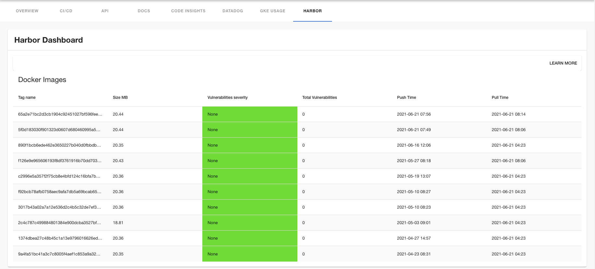
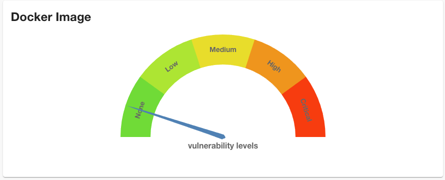

# Backstage Harbor plugin 
[](https://sonarcloud.io/dashboard?id=BESTSELLER_backstage-plugin-harbor)


Welcome to the harbor backend plugin!
This plugin will show you the will show information about your docker images within harbor




## Getting started

### Enabling frontend 
```bash
cd package/app
yarn add @bestsellerit/backstage-plugin-harbor
```
```ts
// packages/app/src/plugins.ts
export { plugin as harbor } from '@bestsellerit/backstage-plugin-harbor';
```
```ts
// packages/app/src/components/catalog/EntityPage.tsx
import {
  Router as HarborRouter,
  isHarborAvailable,
  HarborWidget,
} from '@bestsellerit/backstage-plugin-harbor';

const serviceEntityPage = (
  <EntityPageLayout>
    // ...
    <EntityLayout.Route path="/harbor" title="Harbor">
      <EntityHarborContent />
    </EntityLayout.Route>
  </EntityPageLayout>
)
```


```ts
// packages/app/src/components/catalog/EntityPage.tsx

const overviewContent = (
  <Grid container spacing={6} alignItems="stretch">
   // ...
    <EntitySwitch>
      <EntitySwitch.Case if={isHarborAvailable}>
        <Grid item>
         <EntityHarborCard/>
        </Grid>
      </EntitySwitch.Case>
    </EntitySwitch>
    ...
  </Grid>
);
```

### Enabling backend

```bash
cd packages/backend
yarn add @bestsellerit/backstage-plugin-harbor-backend
```

Create a new file named `packages/backend/src/plugins/harbor.ts`, and add the following to it

```ts
import { createRouter } from '@bestsellerit/backstage-plugin-harbor-backend';
import { Router } from 'express';
import { PluginEnvironment } from '../types';

export default async function createPlugin({
  logger,
  config,
}: PluginEnvironment): Promise<Router> {
  return await createRouter({ logger, config });
}
```

And finally, wire this into the overall backend router. Edit `packages/backend/src/index.ts`

```ts
import harbor from './plugins/harbor';
// ...
async function main() {
  // ...
  const harborEnv = useHotMemoize(module, () => createEnv('harbor'));
  apiRouter.use('/harbor', await harbor(harborEnv));

```


## Configuration
The plugin requires configuration in the Backstage app-config.yaml to connect to harbors API.

```yaml
harbor:
  baseUrl: https://harbor.yourdomain.com
  username: 
    $env: HARBOR_USERNAME
  password:
    $env: HARBOR_PASSWORD

```

Adding annotations and values to your component file.
```yaml
apiVersion: backstage.io/v1alpha1
kind: System
metadata:
  name: sample-system
  description: "A sample system"
  annotations:
    goharbor.io/repository-slug: project/repository
```

## Contributing
Everyone is welcome to contribute to this repository. Feel free to rase [issues](https://github.com/BESTSELLER/backstage-plugin-harbor/issues) or to submit [Pull Requests.](https://github.com/BESTSELLER/backstage-plugin-harbor/pulls)
